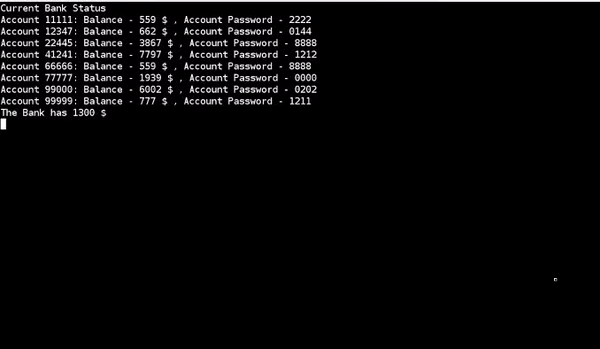
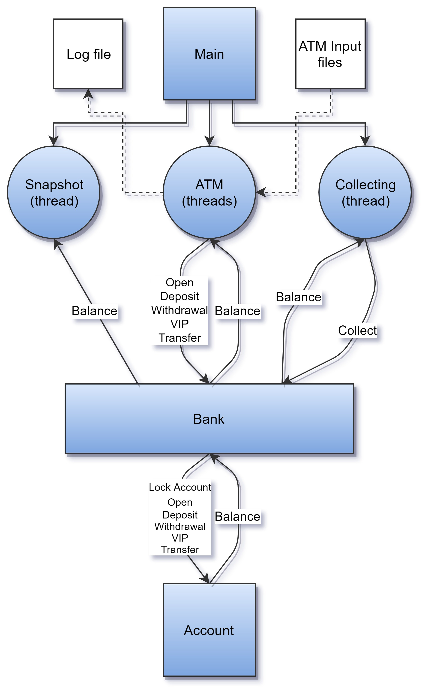

# Bank Simulator
A bank simulator using mutexes and semaphores. 
Dec, 2017  

In this little project, I developed a parallel bank simulator. The bank maintains any number of accounts, In addition to a variable number of ATMs, that are used to access the accounts.

**Description:**
  - Transaction: 
    The Bank offers a variety of transactions: Account opening, Cash withdrawal, Cash deposit, Balance inquiry, Transfer and turning an account into VIP.  
    Each transaction takes a second, This means that two ATMs cannot access the same account at the same time.
  
  - Account: 
    Each account has the following properties: Unique ID, Password, Balance.
  
  - ATM: 
    An ATM can perform one transaction every 100msec. Each ATM receives the transactions in a file given by the user.
  
  - The Bank:  
    The bank charges a commission from the non-VIP accounts every 3 seconds.  
    The commission is at a random rate in the range of 2%-4%.  
    An ATM can't open a new account at the same time as the bank charges the commission.
  
  - Log File:  
    The ATMs write each transaction to a shared log file.  
    
  - Snapshot:  
    The bank displays the current balance of all the accounts, sorted by account number. the display is updated every 0.5sec.  
      

          
        Bank Snapshot
      

 

**Data Structure Diagram:**

**How to run?**  
&nbsp;&nbsp;&nbsp;1) make  
&nbsp;&nbsp;&nbsp;2) ./Bank <Number of ATMs – N> <ATM_1_input_file> <ATM_2_input_file> ... <ATM_N_input_file>

&nbsp;&nbsp;&nbsp;Example:  
&nbsp;&nbsp;&nbsp;&nbsp;&nbsp;&nbsp;$ make  
&nbsp;&nbsp;&nbsp;&nbsp;&nbsp;&nbsp;$ ./Bank 7 ./7_atms_example/*
